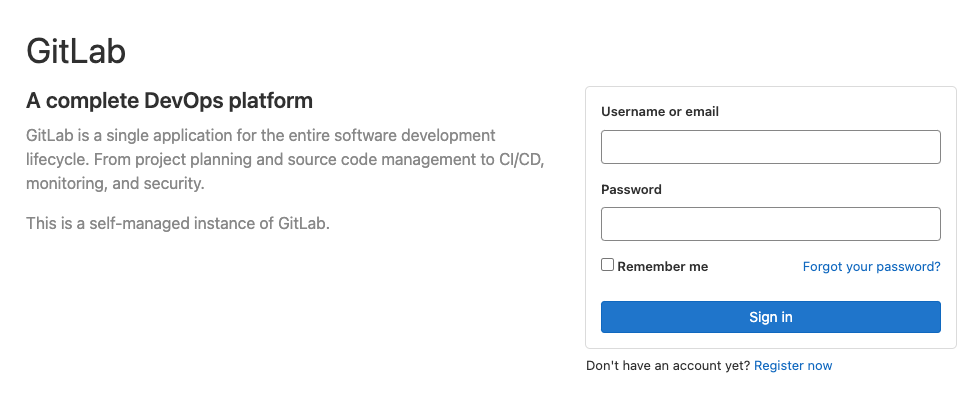
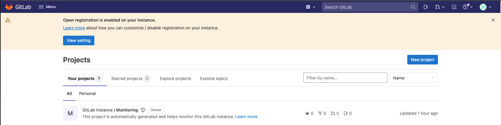
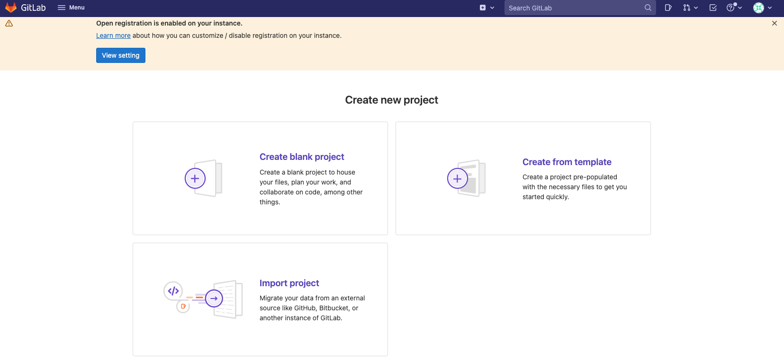
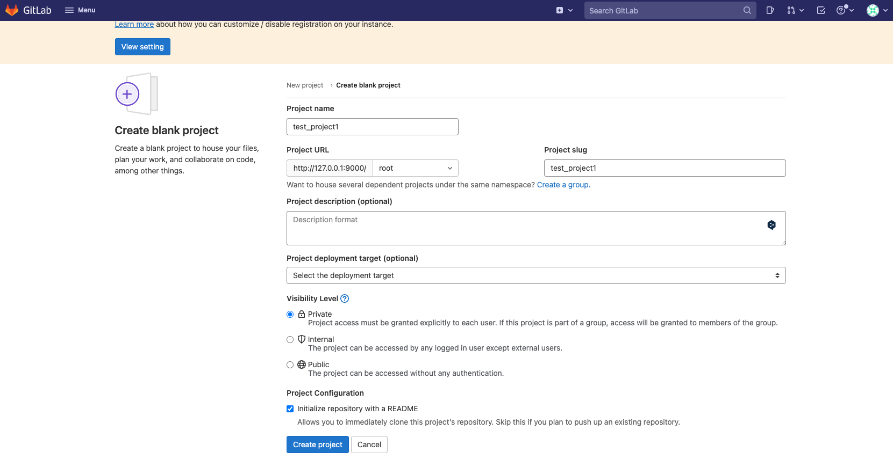
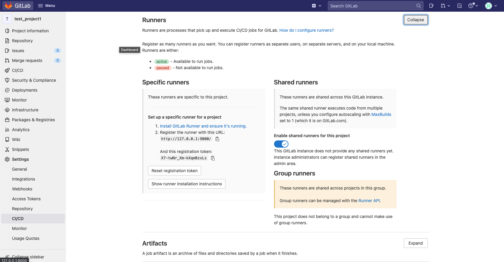
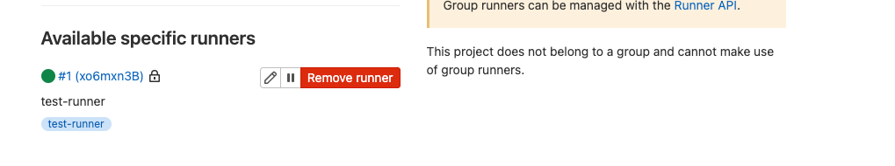
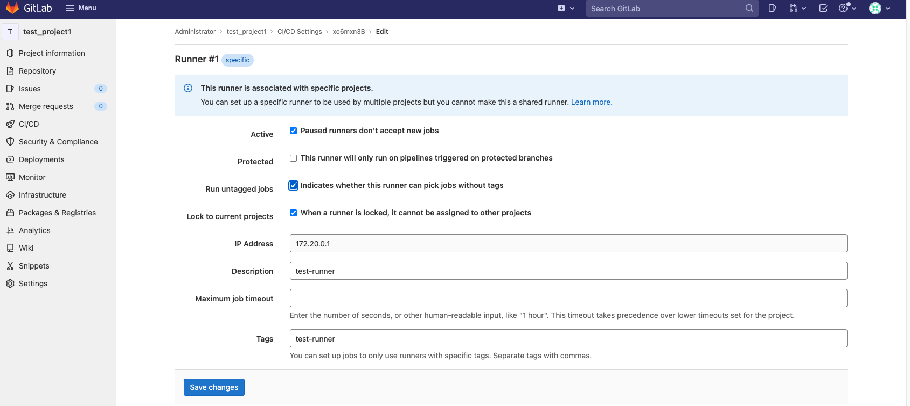
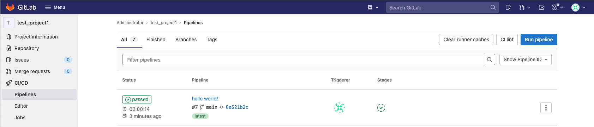
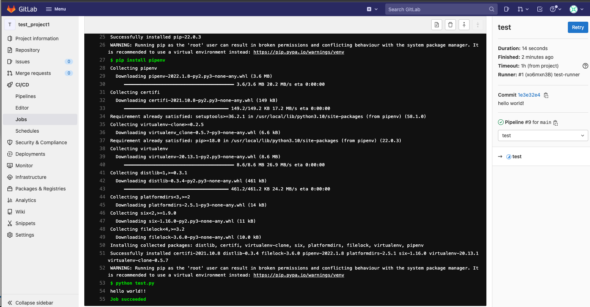

# docker を利用した gitlab/gitlab-runner 環境の準備

## 目的

docker で gitlab/gitlab-runner を準備

## ディレクトリ構成

概説

- gitlab/gitlab-runner で`docker-compose.yml`は別々で用意する
- 各々のコンテナで設定関連のフォルダをローカルマウントする

構成

- gitlab/gitlab-runner 環境構築時のディレクトリ構成

  ```bash
  .
  ├── README.md
  ├── ansible
  │   ├── down.yml
  │   └── up.yml
  ├── gitlab
  │   ├── docker-compose.yml
  │   └── gitlab #ローカルマウント用ディレクトリ
  ├── gitlab-runner
  │   ├── docker-compose.yml
  │   └── gitlab-runner #ローカルマウント用ディレクトリ
  └── images
  ```

- テスト用プロジェクトのディレクトリ構成

  ```bash
  .
  ├── .gitlab-ci.yml
  ├── README.md
  └── test.py
  ```

## 手順

### gitlab/gitlab-runner 環境の準備

1. コンテナを立ち上げる

   `./gitlab`と`./gitlab-runner`のそれぞれで`docker-compose`を実行する。

   ```bash
   docker-compose up -d
   ```

   `-d`はバックグランドで実行させるオプション。
   docker-sompose の実行ログを確認したい場合は下記を実行する。

   ```bash
   docker-compose logs
   ```

1. gitlab へログインする

   1. ブラウザで `127.0.0.1:9000`にアクセスする

      

   1. Administrator でログインする

      | Username | Password |
      | -------- | -------- |
      | root     | 後述     |

      password は`./gitlab`で下記を実行することにより取得する。

      ```bash
      docker compose exec gitlab cat /etc/gitlab/initial_root_password
      ```

      ローカルマウントされているフォルダ内に存在するので、そちらを確認してもよい。

### テスト用プロジェクトの設定

1. テスト用プロジェクトを作成する

   1. 「New Project」をクリック
      

   1. 「Create blank project」をクリック
      

   1. 適当な情報を入力し、プロジェクトを作成する
      

1. プロジェクトのトークンを取得する

   Serrings > CI/CD > Runners で Expand をクリックする。
   

1. gitlab-runner 側で、gitlab のトークン（1 つ前で払い出したもの）を登録する

   1. `./gitlab-runner`で下記を実行し、コンテナに入る

      ```bash
      docker compose exec gitlab-runner /bin/bash
      ```

   1. トークンと URL の登録

      gitlab-runner コンテナの内側で下記を実行する。

      ```bash
      itlab-runner register
      ```

      以下、対話的に設定を入力していく。

      ```bash
      Runtime platform                                    arch=amd64 os=linux pid=31 revision=565b6c0b version=14.8.0
      Running in system-mode.

      Enter the GitLab instance URL (for example, https://gitlab.com/):
      http://192.168.10.39:9000/ # <- 前の手順で確認したURLではなく、ホストのIPアドレス
      Enter the registration token:
      XXXXXXXXXXXXXXXXXXXX # <- 前の手順で確認したトークン
      Enter a description for the runner:
      [gitlab-runner]: test-runner
      Enter tags for the runner (comma-separated):
      test-runner
      Enter optional maintenance note for the runner:

      Registering runner... succeeded                     runner=RKAutDws
      Enter an executor: kubernetes, docker, shell, ssh, virtualbox, docker+machine, docker-ssh+machine, custom, docker-ssh, parallels:
      docker  # <- dockerを選択
      Enter the default Docker image (for example, ruby:2.7):
      python:3.10 # <- とりあえずpython
      Runner registered successfully. Feel free to start it, but if it's running already the config should be automatically reloaded!
      ```

      注意点として、`GitLab instance URL`では Docker ホストの IP アドレスを入力する必要がある。
      gitlab の setting > CI/CD > Runner ページでは、ブラウザアクセス時に利用した`127.0.0.1`などが表示されていると思われるが、そのままでは register に失敗する。

1. gitlab 側で登録の確認

   settings > CI/CD > runner から確認する。
   

1. tag なしで実行できるように設定

   settings > CI/CD > runner から設定する。
   

1. gitlab-runner で extra_hosts を設定する

   `/etc/gitlab-runner/config.toml`を下記のように編集する。
   ローカルマウントされているフォルダ内にあるので、そちらから編集すると簡単で良い。

   ```toml
   concurrent = 1
   check_interval = 0

   [session_server]
   session_timeout = 1800

   [[runners]]
   name = "test-runner"
   url = "http://192.168.10.39:9000/"
   token = "xo6mxn3B-F4LXj1jxExz"
   executor = "docker"
   clone_url = "http://192.168.10.39:9000/" # 追記
   [runners.custom_build_dir]
   [runners.cache]
      [runners.cache.s3]
      [runners.cache.gcs]
      [runners.cache.azure]
   [runners.docker]
      extra_hosts = ["gitlab:192.168.10.39"] #追記
      tls_verify = false
      image = "python:3.10"
      privileged = false
      disable_entrypoint_overwrite = false
      oom_kill_disable = false
      disable_cache = false
      volumes = ["/cache"]
      shm_size = 0
   ```

### CI/CD の実行確認

1. テスト用プロジェクトをクローンする

   下記のコマンドでは、テスト用に作成した`test_project1`プロジェクトを clone している。

   ```bash
   git clone http://127.0.0.1:9000/root/test_project1.git
   ```

   clone 先(=開発環境)は、gitlab/gitlab-runner コンテナのホストと疎通が取れる環境であればどこでも良い。

1. `gitlab-ci.yml`を作成する

   クローンしてきたプロジェクトのルートで、`.gitlab-ci.yml`を作成する。

   ```yml
   image: python:3.10

   test:
   script:
     - pip install --upgrade pip
     - pip install pipenv
     - python test.py
   ```

   ここでは python を使った開発を行うプロジェクトだと想定し、python 実行用のコンテナを準備している。

1. (オプション)テスト実行用の python ファイルを作成

   開発中の python スクリプトとして、下記の内容で`test.py`を作成する。

   ```python
   print("hello world!!")
   ```

1. CI/CD の実行を確認する

   1. テスト用プロジェクトをローカルからリモート（gitlab）にプッシュする

      ローカルプロジェクトで、下記を順に実行する。

      ```bash
      git add .
      git commit -a -m "hello world!"
      git push
      ```

   1. gitlab のテスト用プロジェクトで、CI/CD から実行結果を確認する

      

      `passed` と表示されていれば OK。

      実行結果の一例
      

### (おまけ)ansible で up/down を一括管理

gitlab, gitlab-runner を一括 up

```bash
ansible-playbook ansible/up.yml
```

gitlab, gitlab-runner を一括 down

```bash
ansible-playbook ansible/down.yml
```
